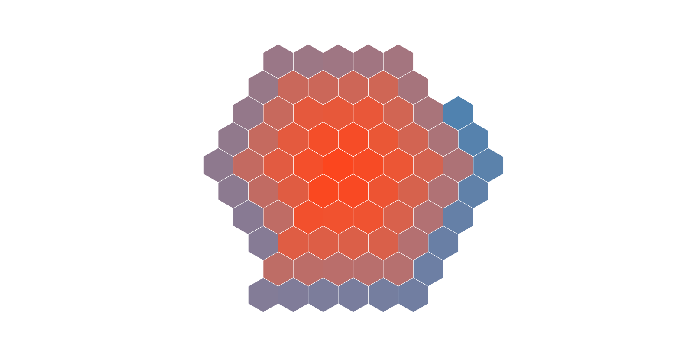

# hex-spiral

A generator of coordinates that can be used to create spirals of hexagons. This module only provides the coordinates of the hexagons centers forming a spiral, but it can be used with Mike Bostock's d3 plugin [d3-hexbin](https://github.com/d3/d3-hexbin) to actually draw the hexagons as shown in the example (click on the image).

[](https://bl.ocks.org/mfilippo/4f48d2ddbbf3ab4a88598881fcfa60e7)

## API Reference

<a name="hexspiral_generateHexCenters" href="#hexspiral_generateHexCenters">#</a> <i>hexspiral</i>.<b>generateHexCenters</b>(<i>cx</i>, <i>cy</i>, <i>hexRadius</i>, <i>n</i>)

Returns a list of points that can be used to draw a spiral of hexagons. The coordinates of each point can be accessed by using *x* and *y* properties.

The *cx* and *cy* arguments specify the center of the spiral, where the first point will be placed. The *hexRadius* argument represents the radius length of the hexagons, it is used to calcuate the distance between the points. If the hexagons will be drawn with the same radius specified here, then they will fit without any empty space between them. The *n* argumemt specifies the number of points to be generate.

By using the [d3-hexbin](https://github.com/d3/d3-hexbin) plugin, a spiral of hexagons can be drawn as follows:

```js
var hexCenters = hexspiral.generateHexCenters(cx, cy, hexRadius, hexNumber),
    hexbin = d3.hexbin().radius(hexRadius);

svg.selectAll('path')
    .data(hexCenters)
    .enter().append('path')
    .attr("d", function(d) { return "M" + d.x + "," + d.y + hexbin.hexagon(); });
```

See the example for more details.
